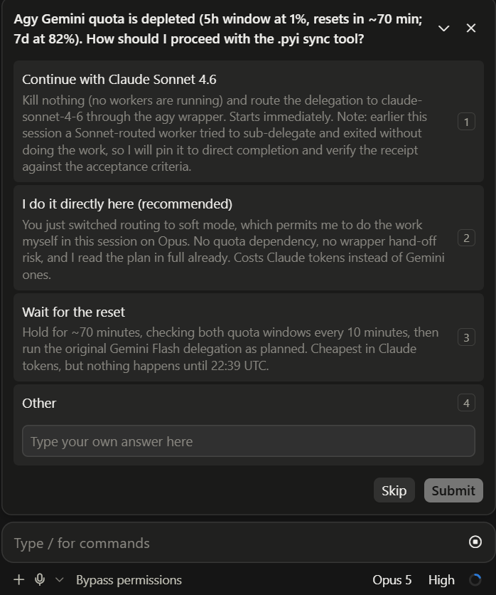

<div align="center">

# Polyphony

**Multi-model orchestration for Claude Code and Codex, powered by Antigravity.**


Claude Code or Codex conducts the workflow. Gemini handles delegated execution through
a shared, verifiable toolchain.

</div>

---

## About

Polyphony gives Claude Code and Codex the same Antigravity (`agy`) worker toolkit. It
reduces main-agent context use while keeping execution scoped, observable, and verifiable.

- scoped implementation and general delegation
- read-only repository scouting and independent diff review
- web research and media analysis
- background jobs, 5h/7d quota control, traces, diagnostics, migration, Cloud debugging, and cost comparison
- non-blocking reminders when a task could be delegated to Gemini

On Windows, the bundled `agy-headless-bridge` v1.2.1 runs headless workers through ConPTY;
no separate bridge installation is required.

## Requirements

- [Antigravity CLI](https://antigravity.google/docs/cli-using) (`agy`), installed and authenticated, plus [Claude Code](https://docs.anthropic.com/en/docs/claude-code), Codex, or both
- Python 3.9 or newer, with [pywinpty](https://pypi.org/project/pywinpty/) on Windows
- On Windows: Git Bash, included with [Git for Windows](https://git-scm.com/download/win), for the Bash wrappers

On native Windows, install `pywinpty` and authenticate Antigravity once:

```powershell
py -3 -m pip install -U pywinpty
agy
agy models
```

## Install for Claude Code

Run these commands inside Claude Code:

```text
/plugin marketplace add GryAsl/Polyphony
/plugin install antigravity@polyphony
/antigravity:setup
```

This installs the slash commands, skill, custom agent, wrappers, and optional delegation reminders.

## Install for Codex

```powershell
codex plugin marketplace add https://github.com/GryAsl/Polyphony
codex plugin add antigravity@polyphony
```

Start a new Codex task after installation. The plugin provides direct MCP tools for delegation, scouting, review, research, media, jobs, quota control, traces, diagnostics, migration, Cloud debugging, and cost comparison. Note that Codex plugin hooks must be reviewed and trusted whenever their definitions change.

## Routing modes

Polyphony provides two session-level routing modes:

- **Always use Agy (strict)**: Broad or substantive Agy-capable work (discovery, implementation, review, tests/build/lint diagnosis, Git operations, research, media analysis, native subagents, and general automation) is routed through Agy. Tiny local helpers plus up to three bounded operations on one small file remain available to the host, as do host-only connectors. A substantive delegated turn requires a completed, successful Agy result before stopping.
- **Use Agy when appropriate (soft)**: Non-blocking advisory reminders; native execution remains permitted.

Soft is the post-selection default. The mode controls how the host agent divides work between
Agy/Gemini workers:

- **Soft** keeps the workflow flexible. The host decides case by case whether delegation
  is worthwhile, so small or simple requests can stay with the host agent.
- **Strict** delegates substantive work—including exploration, edits, review, tests, and
  Git operations—to Agy/Gemini workers. The host agent mainly orchestrates the workers
  and reports the result.

<p align="center">
  
</p>

**Default & session start:** The first session for a workspace asks once for strict or soft. Until
the answer is known, substantive native work is held to the strict gate. The explicit choice is
persisted per workspace and restored for new conversations, reboots, app restarts, reconnects,
resume, and compact events, so a hook reload or a missing ephemeral session file cannot reopen the
same question. A missing or invalid persisted choice asks again rather than guessing.

**Control-plane exceptions:** Mode changes, quota checks/choices, job/trace/doctor/cancel management, bootstrap policy reading, bounded local conductor checks, and conversational user interaction are exempt from delegation gating.

**Manual switching:** Explicitly switch anytime with unambiguous phrasing such as "switch Agy mode to strict" or "set Agy mode to soft".

## Model routing

Calls default to High. Choose Medium explicitly only for a clearly simple task:

| Tier | Use it for | Model selection |
| --- | --- | --- |
| `flash` | Default; especially complex reasoning, architecture, concurrency/security, difficult debugging, ambiguous multi-file work, or adversarial review | Newest available Gemini Flash, High effort |
| `flash-medium` | Explicit option for simple, routine, mechanical, or tightly bounded work | Newest available Gemini Flash, Medium effort |
| `pro` | Exceptional escalation only | Configured Gemini Pro model |

There is no Low tier. Both Flash tiers query `agy models` and follow the newest available Gemini Flash family. If discovery is unavailable, they fall back to Gemini 3.8 Flash at the selected effort level. Exact models can still be supplied with `--model` or plugin configuration overrides.

## Usage

Claude Code examples:

```text
/antigravity:delegate --tier flash-medium "Add the missing unit tests"
/antigravity:delegate --tier flash "Diagnose this cross-module concurrency bug"
/antigravity:review
/antigravity:research "Research this topic and include source URLs"
/antigravity:quota
```

Codex uses the corresponding `antigravity` MCP tools directly. The MCP adapter calls the same wrappers and returns their stdout, stderr, and exact exit code.

The wrappers are also available from Git Bash:

```text
agy-delegate --tier flash-medium --dir "C:\path\to\repo" --digest "Implement this bounded change"
agy-scout --tier flash-medium --dir "C:\path\to\repo" "Trace the request flow"
agy-review --tier flash --dir "C:\path\to\repo" --staged --goal "Implement feature X"
agy-job start --tier flash --dir "C:\path\to\repo" "Complete this long-running task"
agy-quota --force
```

Routine calls default to 30 minutes. The Codex MCP transport allows 35 minutes so a healthy long-running worker can return before the transport closes. Use `--timeout` when a task needs a different wrapper deadline.

For substantial work, keep that generous budget: use `--timeout 45m` or `--timeout 60m`
for broad multi-file, Unity, or build-heavy tasks. Short timeouts are intended only for
health probes; the Windows idle timeout is normally derived from the hard deadline.

Keep authored task instructions at 200–500 words and always below 800 words. At 800,
Polyphony requires summarization, including for stdin and task files assembled in pieces.
Reference source paths instead of pasting code. Automatically supplied review diffs have
a separate data-size limit; inline transport also retains its 24,000-byte ceiling.

**Strict-mode exceptions:** Tiny orchestration helpers (pure Python argument/text/arithmetic probes, working-directory or Git status/HEAD checks, temporary Agy prompt preparation) run locally. Host-only tools without equivalent Agy access remain advisory. Substantive discovery, implementation, review, tests and Git mutations still require Agy; a short command or the word `python` alone does not make substantive work exempt.

## Gemini quota control

The plugin reads Agy's zero-token `/usage` response and tracks both the Gemini **5h** and
**7d** windows. A failed, empty, or timed-out Gemini call triggers an immediate check.
If either window has **2% or less remaining**, the wrapper enters depleted mode and does
not switch models automatically.

<p align="center">
  
</p>

Claude or Codex must ask the user to choose one of these paths:

1. Kill active Agy workers that are no longer progressing and continue the interrupted
   task with exact model `claude-sonnet-4-6`.
2. Keep the workers alive, wait for quota reset, and check both windows every 10 minutes.

Record the choice with `/antigravity:quota sonnet|wait`, `agy-quota --decision
sonnet|wait`, or the Codex `quota` MCP tool. `agy-job cancel-all` covers plugin-managed
jobs; the host must cancel any stalled tool tasks it started. Waiting resumes Gemini only
after both windows are above 2%.

For a user-approved Sonnet 4.6 fallback, Polyphony requires the worker to execute the task
directly without spawning another agent. A non-empty response and exit code 0 are not
enough: the wrapper also requires a machine-readable completion status and concise concrete
evidence, preventing a delegation promise from being mistaken for completed work.

The tracker emits a one-time notice when either window crosses 75%, 50%, 25%, or 10%
remaining. A threshold is not announced again until that quota window resets above it.

## Polyphony update checks

While Polyphony is in use, its `SessionStart`/`UserPromptSubmit` hooks perform a best-effort
GitHub release check at most once per day by default. The check is read-only: it never
updates itself and never runs an install command without the user's explicit approval.
When a newer release is found, the host agent asks whether to update and shows the exact
host-specific commands. Claude Code uses `claude plugin update antigravity@polyphony -y` followed
by a reload/restart (or `/plugin marketplace update polyphony` then `/reload-plugins` inside its
UI); Codex uses `codex plugin marketplace upgrade polyphony` followed by
`codex plugin add antigravity@polyphony`. After updating, verify the installed version and
reload/start a new Claude session or start a new Codex task so the new plugin is loaded.

The interval can be changed with `POLYPHONY_UPDATE_CHECK_INTERVAL_SECONDS`; the network
timeout defaults to four seconds and can be changed with
`POLYPHONY_UPDATE_CHECK_TIMEOUT_SECONDS`. A failed check is silent and retried at the next
interval. The manual `/antigravity:update` command follows the same approval rule.
Set `POLYPHONY_UPDATE_CHECK=off` to disable these automatic checks.

## Permissions and troubleshooting

Run write-capable tasks on a trusted branch. `--yolo` grants the worker broad access to
files, commands, network access, and process-visible credentials; it remains explicit
unless enabled in plugin or environment settings.

If a call fails, run `/antigravity:setup` in Claude Code, the `doctor` MCP tool in Codex, or `agy-doctor` from Git Bash. More diagnostics are in [Troubleshooting](docs/TROUBLESHOOTING.md).

## Why Polyphony uses ConPTY on Windows

[ConPTY](https://learn.microsoft.com/en-us/windows/console/pseudoconsoles) is the Windows
pseudoconsole system developed and maintained by Microsoft. It provides a bidirectional,
UTF-8 terminal channel for console applications—the Windows counterpart to a Unix PTY.
Polyphony uses ConPTY because headless Antigravity sessions still expect real terminal
semantics; ordinary redirected pipes can lose output, stall permission/tool flows, or
misrepresent an active process as hung. The bundled bridge hosts `agy` inside a genuine
Windows pseudoconsole while preserving structured output, Unicode, timeouts, and exit
codes for Claude Code and Codex.
